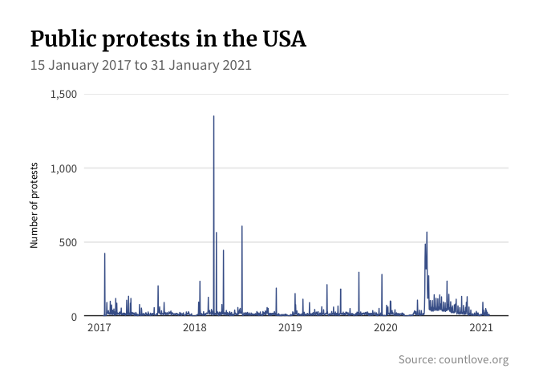
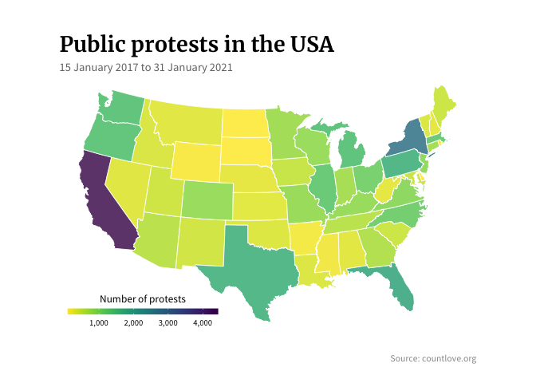
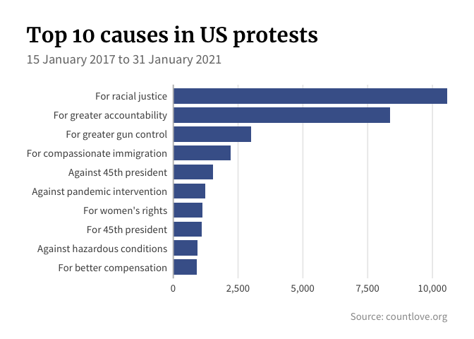

**Data**: Public protests in the USA between January 2017 and January 2021     
**Source**: Count Love    
**URL**: https://countlove.org     

### Setup

#### load necessary packages

```r
library(tidyverse) 
library(scales) 
library(ggtext) 
library(sf) 
library(maps) 
library(viridis)
```

#### read the data

```r
protests <- read_csv("https://countlove.org/data/data.csv")
```

#### inspect the data

```r
glimpse(protests)
```

```
## Rows: 38,097
## Columns: 8
## $ Date                       <date> 2017-01-15, 2017-01-16, 2017-01-16, 2017-0…
## $ Location                   <chr> "Bowie State University, Bowie, MD", "Johns…
## $ Attendees                  <dbl> 1500, 300, 20, NA, 300, NA, NA, NA, 100, 24…
## $ `Event (legacy; see tags)` <chr> "Healthcare", "Civil Rights", "Environment"…
## $ Tags                       <chr> "Healthcare; For Affordable Care Act", "Civ…
## $ Curated                    <chr> "Yes", "Yes", "Yes", "Yes", "Yes", "Yes", "…
## $ Source                     <chr> "http://www.capitalgazette.com/news/ph-ac-c…
## $ `Total Articles`           <dbl> 1, 4, 1, 1, 1, 1, 1, 2, 1, 1, 1, 1, 1, 2, 1…
```

#### how many protests are there?

```r
nrow(protests)
```

```
## [1] 38097
```

### Attendees

#### largest number of attendees at a protest

```r
filter(protests, Attendees == max(protests$Attendees, na.rm = TRUE))
```

```
## # A tibble: 1 × 8
##   Date       Location       Attendees `Event (legacy; … Tags    Curated Source  
##   <date>     <chr>              <dbl> <chr>             <chr>   <chr>   <chr>   
## 1 2017-01-21 Washington, DC    725000 Civil Rights (Wo… Civil … Yes     https:/…
## # … with 1 more variable: Total Articles <dbl>
```

#### calculate the range

```r
range(protests$Attendees, na.rm = TRUE)
```

```
## [1]      0 725000
```

#### calculate percentiles

```r
quantile(protests$Attendees, na.rm = TRUE)
```

```
##        0%       25%       50%       75%      100% 
##      0.00     26.75    100.00    200.00 725000.00
```

### Dates

#### most protests on a single day

```r
count(protests, Date) %>% 
  slice_max(order_by = n, n = 1)
```

```
## # A tibble: 1 × 2
##   Date           n
##   <date>     <int>
## 1 2018-03-14  1351
```

#### plot protests by date

```r
protests %>% 
  count(Date) %>% 
  ggplot(aes(Date, n)) +
  geom_hline(yintercept = 0, size = 1, colour = "#333333") +
  geom_line(colour = "#476298", size = 0.5) +
  scale_y_continuous(expand = c(0,0), limits = c(0, 1500), label = comma) +
  labs(x = NULL, y = "Number of protests",
       title = "Public protests in the USA",
       subtitle = paste0("<span style = 'color:#757575;'>", format(min(protests$Date),'%d %B %Y'), " to ", format(max(protests$Date),'%d %B %Y'), "</span>"),
       caption = "Source: countlove.org") +
  theme_minimal(base_size = 14) +
  theme(plot.margin = unit(rep(1, 4), "cm"),
        panel.grid.major.x = element_blank(),
        panel.grid.minor = element_blank(),
        text = element_text(family = "Source Sans Pro"),
        plot.title.position = "plot",
        plot.title = element_text(family = "Merriweather", face = "bold", size = 20, lineheight = 26),
        plot.subtitle = element_markdown(margin = margin(b = 20)),
        plot.caption = element_text(colour = "grey60", margin = margin(t = 20, b = -10)),
        axis.title.y = element_text(size = 10, hjust = 0.5, margin = margin(r = 10)))
```



### Locations

#### which location had the most protests?

```r
count(protests, Location) %>% 
  arrange(desc(n)) %>% 
  slice(1:5)
```

```
## # A tibble: 5 × 2
##   Location           n
##   <chr>          <int>
## 1 Washington, DC   331
## 2 New York, NY     276
## 3 Detroit, MI      242
## 4 Louisville, KY   231
## 5 Portland, OR     221
```

#### which state had the most protests?

```r
state_protests <- protests %>% 
  mutate(protests, 
         abb = str_to_upper(str_sub(Location, start = -2))) %>% 
  count(abb) %>% 
  arrange(desc(n))
state_protests
```

```
## # A tibble: 55 × 2
##    abb       n
##    <chr> <int>
##  1 CA     4439
##  2 NY     2688
##  3 FL     1823
##  4 PA     1656
##  5 TX     1649
##  6 MI     1411
##  7 WA     1376
##  8 OR     1368
##  9 IL     1273
## 10 MA     1265
## # … with 45 more rows
```

#### create a map

```r
lookup <- tibble(state = state.name) %>%
  bind_cols(tibble(abb = state.abb))

usa <- st_as_sf(map("state", fill = TRUE, plot = FALSE)) %>% 
  mutate(state = str_to_title(ID)) %>% 
  left_join(lookup, by = "state") %>% 
  select(-ID) %>% 
  left_join(state_protests, by = "abb")

ggplot(usa, aes(fill = n)) +
  geom_sf(alpha = 0.8, colour = 'white', size = 0.3) +
  scale_fill_viridis(discrete = F,
                     name = "Number of protests",
                     label = comma,
                     direction = -1,
                     guide = guide_colourbar(
                       direction = "horizontal",
                       barheight = unit(2, units = "mm"),
                       barwidth = unit(50, units = "mm"),
                       title.position = 'top',
                       title.hjust = 0.5,
                       label.hjust = 0.5)) +
  labs(x = NULL, y = NULL,
       title = "Public protests in the USA",
       subtitle = paste0("<span style = 'color:#757575;'>", format(min(protests$Date),'%d %B %Y'), " to ", format(max(protests$Date),'%d %B %Y'), "</span>"),
       caption = "Source: countlove.org") +
  coord_sf(crs = st_crs("+proj=laea +lat_0=45 +lon_0=-100 +x_0=0 +y_0=0 +a=6370997 +b=6370997 +units=m +no_defs"), datum = NA) +
  theme_void() +
  theme(plot.margin = unit(rep(1, 4), "cm"),
        panel.grid.major.x = element_blank(),
        panel.grid.minor = element_blank(),
        text = element_text(family = "Source Sans Pro"),
        plot.title.position = "plot",
        plot.title = element_text(family = "Merriweather", face = "bold", size = 20, lineheight = 26),
        plot.subtitle = element_markdown(margin = margin(t = 5)),
        plot.caption = element_text(colour = "grey60", margin = margin(t = 20, b = -10)),
        legend.position = c(0.2, 0.09),
        legend.title = element_text(size = 10),
        legend.text = element_text(size = 8))
```



### Causes

#### most common protest tag set

```r
count(protests, Tags) %>% 
  arrange(desc(n)) %>% 
  slice(1:5)
```

```
## # A tibble: 5 × 2
##   Tags                                                                     n
##   <chr>                                                                <int>
## 1 Civil Rights; For racial justice; For greater accountability; Police  7770
## 2 Guns; For greater gun control; National Walkout Day                   1312
## 3 Guns; For greater gun control                                         1052
## 4 Civil Rights; For women's rights; Women's March                        898
## 5 Healthcare; Against pandemic intervention; Coronavirus                 882
```

#### split out tags

```r
causes <- protests %>% 
  select(Date, Location, Attendees, Tags) %>% 
  separate_rows(Tags, sep = "; ", convert = TRUE) %>%
  mutate(State = str_to_upper(str_sub(Location, start = -2)),
         Location = str_remove(Location, "\\,[^,]*$"),
         Category = case_when(str_detect(Tags, "Civil Rights|Collective Bargaining|Education|Environment|Executive|Guns|Healthcare|Immigration|International|Judicial|Legislative|Other") ~ Tags, TRUE ~ as.character(NA)),
         Position = case_when(str_detect(Tags, "For|Against|Pro|Anti") ~ Tags, TRUE ~ as.character(NA)),
         Detail = case_when(is.na(Category) & is.na(Position)~ Tags, TRUE ~ as.character(NA))) %>% 
  select(Date, Location, State, Attendees, Category, Position, Detail) %>% 
  pivot_longer(-c(Date, Location, State, Attendees), names_to = "Type", values_to = "Tag") %>%
  filter(!is.na(Tag))
```

#### most common protest category, position, detail tag

```r
causes %>% 
  group_by(Type, Tag) %>% 
  summarise(n = n()) %>% 
  slice_max(order_by = n, n = 1)
```

```
## # A tibble: 3 × 3
## # Groups:   Type [3]
##   Type     Tag                    n
##   <chr>    <chr>              <int>
## 1 Category Civil Rights       14807
## 2 Detail   Police              8254
## 3 Position For racial justice 10575
```

#### top 10 position tags

```r
filter(causes, Type == "Position") %>% 
  count(Tag) %>% 
  slice_max(order_by = n, n = 10) %>% 
  ggplot(aes(n, fct_reorder(Tag, n))) +
  geom_col(fill = "#476298", width = 0.8) +
  scale_x_continuous(expand = c(0, 0), label = comma) +
  labs(x = NULL, y = NULL) +
  labs(x = NULL, y = NULL,
       title = "Top 10 causes in US protests",
       subtitle = paste0("<span style = 'color:#757575;'>", format(min(protests$Date),'%d %B %Y'), " to ", format(max(protests$Date),'%d %B %Y'), "</span>"),
       caption = "Source: countlove.org") +
  theme_minimal(base_size = 14) +
  theme(text = element_text(family = "Source Sans Pro"),
        plot.margin = unit(rep(1, 4), "cm"),
        panel.grid.major.y = element_blank(),
        panel.grid.minor = element_blank(),
        axis.line.y = element_line(colour = "#bdbdbd"),
        plot.title.position = "plot",
        plot.title = element_text(family = "Merriweather", face = "bold", size = 22, lineheight = 26),
        plot.subtitle = element_markdown(margin = margin(b = 20)),
        plot.caption = element_text(colour = "grey60", margin = margin(t = 20, b = -10)),
        axis.title.x = element_text(hjust = 1, margin = margin(t = 10)))
```



#### main protest locations for 'For racial justice'

```r
filter(protests, str_detect(Tags, regex('For racial justice', ignore_case = T))) %>% 
  count(Location) %>% 
  arrange(desc(n)) %>% 
  slice(1:5)
```

```
## # A tibble: 5 × 2
##   Location           n
##   <chr>          <int>
## 1 Louisville, KY   135
## 2 Dallas, TX       124
## 3 Portland, OR     108
## 4 Detroit, MI      104
## 5 Ellensburg, WA   104
```

